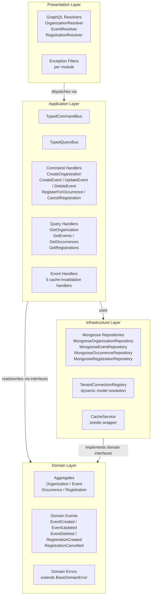
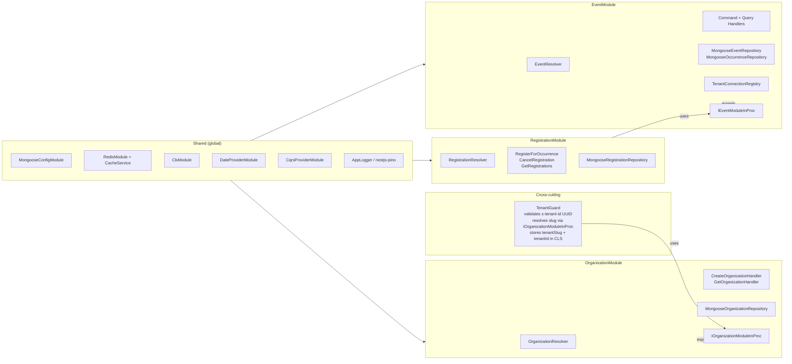
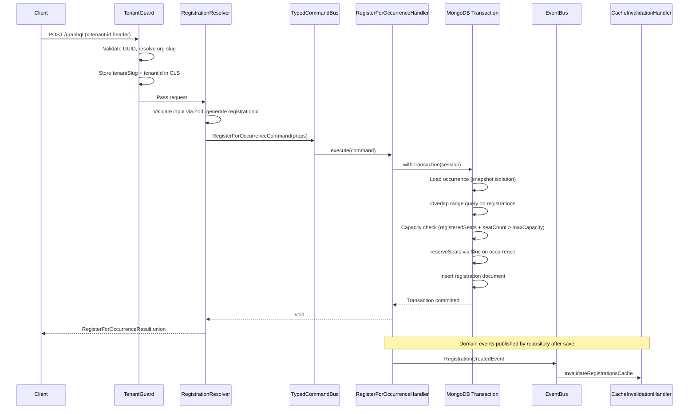

# Architecture

Multi-tenant event scheduling platform built with NestJS + Fastify + Mercurius (GraphQL code-first) + MongoDB + Redis.

---

## a) Overview

### Solution Summary

The platform allows organizations to manage events (including recurring events) and users to register for specific occurrences of those events. Each organization is a tenant; their event and occurrence data is physically isolated in per-tenant MongoDB collections. Registrations are stored in a global collection to enable efficient cross-organization overlap detection.

### Hexagonal Architecture — 4 Layers

The codebase follows a strict 4-layer hexagonal architecture enforced by per-layer rule files loaded into the AI agent at edit time:

**Rules:**
- Domain has zero imports from infrastructure, application, or presentation.
- Commands extend `TypedCommand<void>` — they never return data.
- Queries extend `TypedQuery<TResult>` — they bypass the domain layer and query the database directly via Prisma/Mongoose for optimized read models.
- All business logic lives in domain aggregate methods.

### CQRS Pattern

| Side | Class | Returns | Database access |
|------|-------|---------|-----------------|
| Command | `TypedCommand<void>` | void | Via domain repository interfaces |
| Query | `TypedQuery<TResult>` | Read model (plain type) | Direct Mongoose/Prisma queries — no repository layer |

### Module Structure

### Cross-cutting Concerns

| Concern | Implementation |
|---------|---------------|
| Tenant isolation | `TenantGuard` validates `x-tenant-id` (UUID), resolves org slug via `IOrganizationModuleInProc`, stores `tenantSlug` + `tenantId` in CLS |
| Request context | `ClsService` propagates `correlationId` and `tenantSlug`/`tenantId` throughout the request without manual threading |
| Caching | `CacheService` wraps ioredis with `get/set/del/delPattern`; tenant-scoped keys `{tenantId}:{resource}:{hash}`; cache invalidation triggered by domain events |
| Logging | `nestjs-pino` with CLS-enriched structured output; `correlationId` and `tenantId` on every log line |
| Validation | Zod only — no `class-validator`, no `class-transformer` |

### Request Flow — RegisterForOccurrence

---

## b) Schema Design

### Collections Overview

The platform uses 4 MongoDB collections. Two are tenant-scoped (prefixed with `{tenantSlug}_`), one is global by design.

### organizations

Global collection (no tenant prefix). Stores the tenant identity root — queried by `TenantGuard` on every request.

| Field | Type | Notes |
|-------|------|-------|
| `_id` | `string` (UUID) | Primary key |
| `name` | `string` | Display name |
| `slug` | `string` | URL-safe identifier |
| `createdAt` | `Date` | Auto-generated |

**Indexes:** `{ slug: 1 }` unique — enforced at the database level; `save()` catches `MongoServerError 11000` for slug race conditions.

### {tenantSlug}_events

Tenant-scoped. One collection per tenant (e.g., `acme_events`, `globex_events`). Stores event templates including the optional recurrence pattern.

| Field | Type | Notes |
|-------|------|-------|
| `_id` | `string` (UUID) | Primary key |
| `organizationId` | `string` | FK to organizations |
| `title` | `string` | |
| `description` | `string` | |
| `location` | `string \| null` | Optional |
| `startDate` | `Date` | Base event start |
| `endDate` | `Date` | Base event end |
| `maxCapacity` | `number` | Max registrations per occurrence |
| `recurrencePattern` | `RecurrencePatternProps \| null` | `null` for one-time events |
| `deletedAt` | `Date \| null` | Soft delete |
| `createdAt` | `Date` | Mongoose timestamps |
| `updatedAt` | `Date` | Mongoose timestamps |

**RecurrencePattern subdocument:**

| Field | Type |
|-------|------|
| `frequency` | `"DAILY" \| "WEEKLY" \| "MONTHLY" \| "YEARLY"` |
| `interval` | `number?` |
| `byDay` | `("MO"\|"TU"\|"WE"\|"TH"\|"FR"\|"SA"\|"SU")[]?` |
| `byMonthDay` | `number[] \| null` |
| `byMonth` | `number[] \| null` |
| `until` | `Date \| null` |
| `count` | `number?` |

Expanded using the `rrule` library. A `MAX_OCCURRENCES` guard prevents unbounded generation.

**Indexes:**

| Index | Purpose |
|-------|---------|
| `{ startDate: 1, deletedAt: 1 }` | Date range queries filtered to active events |
| `{ organizationId: 1, deletedAt: 1, startDate: 1 }` | Tenant-scoped event listing |

### {tenantSlug}_occurrences

Tenant-scoped. Concrete occurrence documents materialized from `recurrencePattern` at event creation or update time. Each occurrence has its own `_id`, enabling stable FK references from registrations.

| Field | Type | Notes |
|-------|------|-------|
| `_id` | `string` (UUID) | Primary key |
| `eventId` | `string` | FK to events collection |
| `organizationId` | `string` | |
| `startDate` | `Date` | Concrete date |
| `endDate` | `Date` | Concrete date |
| `title` | `string \| null` | Override from event; `null` = inherit |
| `location` | `string \| null` | Override; `null` = inherit |
| `maxCapacity` | `number \| null` | Override; `null` = inherit from event |
| `registeredSeats` | `number` | Denormalized counter (default 0) |
| `deletedAt` | `Date \| null` | Soft delete |
| `createdAt` | `Date` | |
| `updatedAt` | `Date` | |

**Why `registeredSeats` is denormalized:** Enables atomic capacity checks without a `count()` inside the transaction. `reserveSeats`/`releaseSeats` operations use `$inc` directly on the occurrence document. See Capacity Enforcement decision in section (c).

**Indexes:**

| Index | Purpose |
|-------|---------|
| `{ eventId: 1, deletedAt: 1, startDate: 1 }` | Occurrence listing by event with date range |

### registrations

**Global collection (no tenant prefix).** This is the most important schema decision: registration documents are stored in a single global collection, not in per-tenant collections.

**Why global:** Cross-organization overlap detection requires checking whether a user has any active registration whose time window overlaps the requested occurrence — across all organizations. With per-tenant collections, this would require either a scatter-gather query across all tenant collections (expensive, requires knowing all tenants) or a join (not available in MongoDB). A single global collection makes this a straightforward indexed range query.

| Field | Type | Notes |
|-------|------|-------|
| `_id` | `string` (UUID) | Primary key |
| `occurrenceId` | `string` | FK to `{tenantSlug}_occurrences` |
| `organizationId` | `string` | Denormalized for scoped queries |
| `userId` | `string` | Caller-provided user identifier |
| `seatCount` | `number` | |
| `status` | `"active" \| "cancelled"` | |
| `occurrenceStartDate` | `Date` | Denormalized from occurrence |
| `occurrenceEndDate` | `Date` | Denormalized from occurrence |
| `eventTitle` | `string` | Denormalized from event |
| `deletedAt` | `Date \| null` | Soft delete |
| `createdAt` | `Date` | |
| `updatedAt` | `Date` | |

**Why `occurrenceStartDate`/`occurrenceEndDate`/`eventTitle` are denormalized:** The overlap query `{ userId, status: "active", occurrenceStartDate: { $lt: endDate }, occurrenceEndDate: { $gt: startDate } }` executes against `registrations` only — no cross-collection join to occurrences required. `eventTitle` is denormalized for the registration list display without a second query to the tenant-scoped events collection.

**Indexes:**

| Index | Type | Purpose |
|-------|------|---------|
| `{ userId: 1, occurrenceId: 1 }` | Partial unique (`where status = "active"`) | Prevents duplicate active registrations at DB level |
| `{ userId: 1, status: 1, occurrenceStartDate: 1, occurrenceEndDate: 1 }` | Compound | Overlap range query |
| `{ organizationId: 1, userId: 1, status: 1 }` | Compound | GetRegistrations query (user's registrations within an org) |

---

## c) Alternatives Considered

### Decision 1: Multi-tenancy Strategy

The core question: how to physically isolate tenant data in MongoDB.

| Approach | How it works | Pros | Cons |
|----------|-------------|------|------|
| **Shared collection with `organizationId` filter** | All tenants share `events`, `occurrences` collections. Every query adds `{ organizationId }` to the filter. | Simplest to implement. No connection overhead. Wildcard indexes work. MongoDB's own multi-tenancy guide recommends this for most SaaS apps. | A missing filter clause silently exposes all tenants' data. No physical isolation. Cross-tenant queries possible by accident. |
| **Separate databases per tenant** | Each org gets its own MongoDB database and connection. | Strongest isolation possible. Eliminates any cross-tenant risk entirely. | New `Connection` object per tenant — memory and file-descriptor exhaustion under many tenants. Complex connection pool management. No transactions across tenants. Not viable without a connection governor. |
| **Separate collections per tenant (chosen)** | One shared connection. Collection names are `{tenantSlug}_{collectionName}` (e.g., `acme_events`). A `TenantConnectionRegistry` dynamically resolves Mongoose models, caching them in a `Set<string>` to avoid `OverwriteModelError`. | Physical collection separation without extra connections. Collection-level isolation prevents cross-tenant data leakage from missing filters. Transactions work (single connection). | Collection count grows O(tenants × collections). Mongoose model names must be unique per tenant (solved via registry). No index isolation between tenants sharing a collection name pattern. |

**Why chosen:** The spec explicitly requires tenant isolation at the data layer. Separate collections deliver physical isolation — a missing `organizationId` filter in a query cannot accidentally return another tenant's data, because the model itself is bound to the tenant's collection. Separate databases were rejected due to connection explosion risk. Shared collection was rejected as it relies entirely on query-level discipline for isolation.

---

### Decision 2: Recurring Events Storage

The question: where do occurrence dates live — computed on the fly or stored as documents?

| Approach | How it works | Pros | Cons |
|----------|-------------|------|------|
| **Store only the rrule; expand at query time** | No occurrence documents. `getOccurrences(start, end)` runs rrule expansion in the query handler on every call. | Minimal write amplification. No extra documents at rest. Simple write path. | CPU-bound expansion on every read (uncacheable without materialization). `occurrenceId` does not exist as a stable FK — registrations must reference `eventId + sequenceIndex`, making per-occurrence capacity tracking ambiguous. "Query registrations for occurrence X" becomes a derived concept, not a direct lookup. |
| **Hybrid: store rrule + generate occurrences via rolling cron** | A scheduled job (or on-demand expansion) pre-generates occurrences for a rolling horizon (e.g., next 90 days). New windows added as time passes. | Reduces write latency vs full materialization. Smaller up-front write. | Adds operational complexity: cron job, horizon tracking, gap handling if the job fails. Not suitable for a system without scheduler infrastructure. |
| **Full materialization at write time (chosen)** | When an event with a `recurrencePattern` is created or its pattern changes, `materializeOccurrenceDates` expands the rrule synchronously and inserts concrete `Occurrence` documents. A `MAX_OCCURRENCES` constant prevents unbounded generation. | Every occurrence has a stable `_id` as a FK target. Range queries are indexed scans with no runtime computation. Capacity enforcement per occurrence is unambiguous. Registration list display requires no join back to the event. | Write amplification on create/update (acceptable at event creation cadence). Occurrences beyond `MAX_OCCURRENCES` are not generated (documented limitation). |

**Why chosen:** Full materialization is correct for this problem size — events do not recur infinitely, and `MAX_OCCURRENCES` bounds the worst case. A stable `occurrenceId` FK is essential for atomic capacity enforcement (each occurrence needs its own `registeredSeats` counter) and for the registration data model. Occurrence range queries become simple indexed date scans with no runtime computation.

---

### Decision 3: Conflict Detection Mechanism

The question: how to prevent a user from registering for two time-overlapping occurrences atomically.

| Approach | How it works | Pros | Cons |
|----------|-------------|------|------|
| **Application-level read-then-write (no transaction)** | Handler reads existing registrations, checks for overlap in code, writes if clear. | Simple to implement. No replica set required. | TOCTOU race: two concurrent requests both pass the check, both insert, user ends up double-booked. Unacceptable for any concurrent system. |
| **Pessimistic lock (Redis or DB lock on user)** | Acquire a per-user lock before the check-and-insert sequence. Serialize all registrations for a given user. | Eliminates the race. Predictable behavior. | MongoDB has no row-level locks natively. Application-level Redis lock adds infrastructure dependency, TTL complexity, and latency. Crash without unlock causes permanent lock until TTL. |
| **MongoDB transaction + denormalized dates (chosen)** | `withTransaction()` wraps the overlap range query and the registration insert in a single multi-document transaction. `occurrenceStartDate`/`occurrenceEndDate` denormalized on registrations enable the query `{ userId, status: "active", occurrenceStartDate: { $lt: endDate }, occurrenceEndDate: { $gt: startDate } }` in one collection. A partial unique index on `{ userId, occurrenceId }` (where `status = "active"`) adds a second line of defence at the DB level. | Atomic by definition. No external locking. `withTransaction` retries on `TransientTransactionError`. Overlap predicate is strict (`$lt`/`$gt`), allowing back-to-back events. | Requires MongoDB replica set. Slightly higher write latency than a single document operation. |

**Why chosen:** MongoDB transactions are the natural tool for this atomic read-then-write pattern. The replica set is already required by the stack for `MongooseRepositoryBase`, so there is no additional infrastructure cost. The `withTransaction` helper handles retry on transient errors automatically. No external locking service is needed.

---

### Decision 4: Capacity Enforcement Approach

The question: how to prevent over-booking an occurrence under concurrent registrations.

| Approach | How it works | Pros | Cons |
|----------|-------------|------|------|
| **`count()` query inside transaction** | Before inserting, run `db.registrations.count({ occurrenceId, status: "active" })` inside the transaction. | Always accurate under snapshot isolation. No denormalized counter to maintain. | O(registrations) scan per registration write even with an index. Scales poorly for popular occurrences with thousands of registrations. |
| **Atomic `findOneAndUpdate` with conditional predicate** | No transaction. `findOneAndUpdate({ occurrenceId, registeredSeats: { $lt: maxCapacity } }, { $inc: { registeredSeats: 1 } })` — returns null if capacity is full. | Pure atomic single-document operation. No session needed. | Cannot also check time-overlap in the same atomic unit. The two checks (capacity + overlap) are decoupled, creating a TOCTOU gap between them. Capacity and conflict detection require two separate atomic operations. |
| **Denormalized counter + transaction (chosen)** | `registeredSeats` on the occurrence document is the source of truth. Inside the existing overlap-detection transaction, the handler loads the occurrence (snapshot-isolated), checks `registeredSeats + seatCount > maxCapacity`, then calls `reserveSeats()` which issues `{ $inc: { registeredSeats: seatCount } }` inside the same session. | Both capacity and overlap checks execute in a single transaction — atomically. No `count()` scan. `registeredSeats` also serves the "available seats" display in occurrence queries without an extra aggregation. | Counter can become stale if transactions are aborted without proper rollback (Mongoose `withTransaction` handles rollback automatically). |

**Why chosen:** The transaction is already required for overlap detection. Adding the capacity check inside the same transaction is a natural extension with no additional infrastructure. Reading `registeredSeats` under snapshot isolation and incrementing with `$inc` is atomic and correct. The denormalized counter also eliminates the need for an aggregation when displaying available capacity on occurrence listings.

---

## d) Trade-offs

### Current Limitations

**Cache invalidation uses `KEYS` not `SCAN`**
`CacheService.delPattern()` issues a Redis `KEYS {pattern}` command, which is O(n) across the entire keyspace. On a large Redis instance with millions of keys, this blocks the Redis event loop. Production systems should use `SCAN` with a cursor for non-blocking iteration. This is the most significant operational risk in the current implementation.

**One-time occurrence materialization, no rolling horizon**
Recurring events are fully materialized at create/update time up to `MAX_OCCURRENCES`. If an event recurs indefinitely (e.g., `DAILY` with no `until` or `count`), only the first `MAX_OCCURRENCES` occurrences are created. There is no scheduled job to expand the horizon as time passes. A production system would need a cron-based re-expansion job or on-demand expansion triggered when a query requests occurrences beyond the materialized range.

**No authentication or authorization layer**
`userId` and organization membership are caller-provided with no verification. Any client that knows an organization's UUID can register for its events. A production system would validate a JWT, extract the `userId` and `organizationId` claims, and enforce that the caller is a member of the organization they are acting on behalf of.

**No DataLoader for GraphQL N+1**
Nested resolvers (e.g., `event.occurrences`) issue one database query per parent entity in the response. Under load, this produces N+1 query patterns. A production system would use `dataloader` to batch and de-duplicate queries within a single GraphQL request.

**No rate limiting**
The API has no per-client or per-tenant rate limits. NestJS ThrottlerModule would address this.

**Integration and e2e tests require a running Docker Compose**
The test suite does not use Testcontainers. Running `pnpm test:int` or `pnpm test:e2e` requires `docker compose up -d` to be executed first. In a CI environment, this means the Docker Compose stack must be started as a pre-step in the pipeline.

### What Would Change with More Time

| Improvement | Rationale |
|-------------|-----------|
| Replace `KEYS` with `SCAN` in `delPattern` | Eliminates the Redis O(n) blocking risk in production |
| Scheduled occurrence horizon expansion | Makes `MAX_OCCURRENCES` a soft limit rather than a hard ceiling |
| JWT authentication + RBAC authorization | Moves from caller-asserted identity to verified identity |
| DataLoader for nested resolvers | Eliminates N+1 under concurrent GraphQL queries |
| Testcontainers for CI | Removes the Docker Compose pre-step from CI pipelines |
| Rate limiting via NestJS ThrottlerModule | Prevents API abuse and protects against capacity exhaustion attacks |
